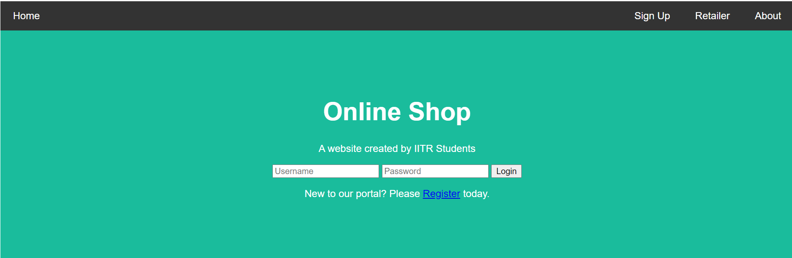
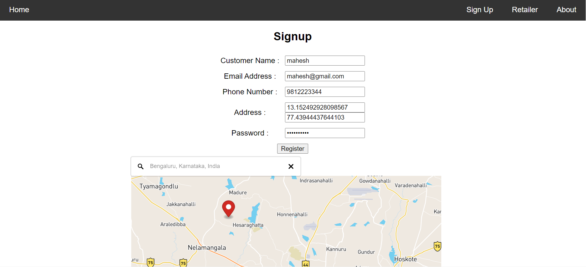
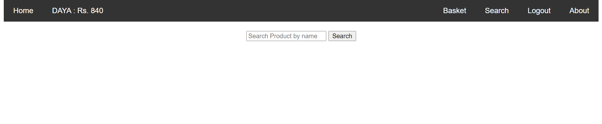
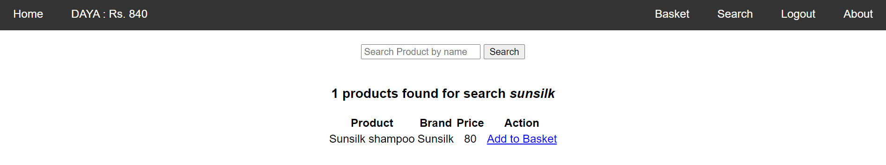
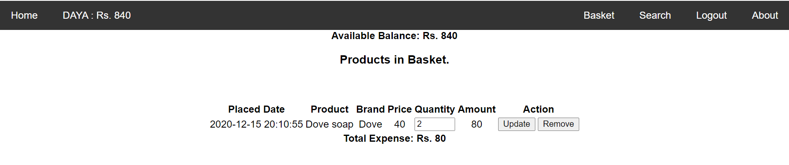
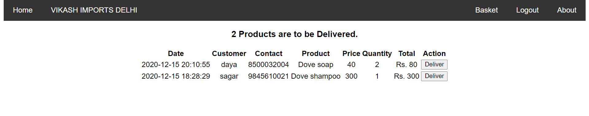
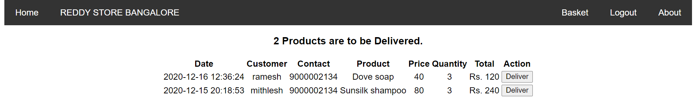

# Online Store

## Problem Statement
Design and develop an online portal where a customer can register to the nearby retailer and order daily need items. Develop the provision for the online payment system for home delivery.

_**How to map the customer with the nearest retailer shop?**_

## Tools and Technologies
- PHP 
- Python
- MySQL
- HTML
- CSS

## How to run this project on your system

### Software Requirements : Xampp (for windows) or LAMP (for Linux)
- Download the project and keep it in xampp folder for your system
- Run Xampp control panel and run apache and mysql
- Open localhost in your browser and then open phpMyAdmin
- Create a new database **onlinestore** and import tables from the *database/onlinestore.sql* file
- Now open localhost/xampp/onlinestore in your browser

## Modules
### Customer module:
- Customer can register/login into the portal.
- He/she can search for product according to his/her need.
- The customer can place the order in basket.

### Retailer module:
- Retailer can login on the portal.
- Retailer can see the orders placed by the customer.
- Retailer have choice to deliver the product items to customer address .

## Home Page

    

- A customer can login if he/she already has an account. 
- Otherwise, they can register by clicking on *Register* link
- Similarly, a retailer can login by clicking on *Retailer* link on menu bar

## Customer Registration page

    

- Address (coordinates) of the customer is picked automatically once the customer pin points his/her location in the map.
- This address is used to map the customer to the nearest retailer.
- Upon successfull registration, the customer gets Rs 1000 in his/her wallet

## Customer Login

    

- After login, the customer can see his/her name and the balance in the wallet in the menu bar
- He/She can search product and place order
- With each order or cancellation of order, the balance of the wallet is updated accordingly
- If the balance is not sufficient, the customer won't be able to order

## Search Product

    

- A customer can search products and put them into basket

## Basket

    

- All the products added by customer will be in the basket. These products will be delivered.
- The customer can change the number of quantity or remove the product from the basket. The balance in the wallet will be updated accordingly.

## Retailer

    
  

    

- Once retailer logs in, he/she can see all the orders to be delivered to the customers. He can deliver the product by clicking on *deliver* button

## Challenge: How to map the customer with the nearest retailer shop?

- Using naïve approach, finding all the distances and taking minimum distance would take O(n) time.
- For reducing T.C. we stored the coordinates of retailer in the **K-Dimensional tree**. Here we took **2D tree** because we had only latitude and longitudes.
- Insert in 2D tree takes O(log n) time and searching nearest retailer to a customer will also take O(log n) time. 
 
## References

- https://www.datasciencecentral.com/profiles/blogs/implementing-kd-tree-for-fast-range-search-nearest-neighbor
- https://en.wikipedia.org/wiki/Nearest_neighbor_search
- https://en.wikipedia.org/wiki/Geographical_distance
- https://en.wikipedia.org/wiki/Haversine_formula
- https://www.geeksforgeeks.org/k-dimensional-tree/

## Feedback

You feedbacks are always welcome. Thanks for reading.
